# Daily Event Insurance - Operational System Architecture

## Overview

This document describes the complete operational flow of the Daily Event Insurance platform, detailing what happens at each stage, who is responsible, and the technical systems involved.

---

## System Architecture Overview

---

## Complete Customer Journey Flow

```mermaid
flowchart LR
    subgraph Discovery["1️⃣ DISCOVERY"]
        A1[Guest visits<br/>partner website]
        A2[Sees coverage<br/>option at checkout]
    end

    subgraph Purchase["2️⃣ PURCHASE"]
        B1[Selects $40<br/>day coverage]
        B2[Enters basic info]
        B3[Payment processed]
    end

    subgraph Fulfillment["3️⃣ FULFILLMENT"]
        C1[Certificate<br/>generated instantly]
        C2[Email confirmation<br/>sent]
        C3[Coverage active<br/>immediately]
    end

    subgraph Claims["4️⃣ CLAIMS (if needed)"]
        D1[Incident occurs]
        D2[Claim filed via<br/>carrier portal]
        D3[Carrier handles<br/>adjudication]
    end

    A1 --> A2 --> B1 --> B2 --> B3 --> C1 --> C2 --> C3
    C3 -.->|If incident| D1 --> D2 --> D3
```

---

## Partner Onboarding Flow

```mermaid
flowchart TB
    subgraph Lead["📥 LEAD CAPTURE"]
        L1[Partner visits<br/>vertical landing page]
        L2[Fills out<br/>demo request form]
        L3[Lead stored in DB]
    end

    subgraph Qualify["✅ QUALIFICATION"]
        Q1[Email sequence<br/>triggered]
        Q2[Sales follow-up<br/>within 24hrs]
        Q3[Demo scheduled]
    end

    subgraph Onboard["🚀 ONBOARDING"]
        O1[Partner agreement<br/>signed]
        O2[Account created<br/>in portal]
        O3[API keys or<br/>widget provided]
    end

    subgraph Active["💰 ACTIVE PARTNER"]
        A1[Integration goes live]
        A2[Policies sold]
        A3[Commissions paid<br/>monthly]
    end

    L1 --> L2 --> L3 --> Q1 --> Q2 --> Q3 --> O1 --> O2 --> O3 --> A1 --> A2 --> A3
```

---

## Technical System Flow - Quote to Certificate

```mermaid
sequenceDiagram
    participant G as Guest
    participant FE as Frontend
    participant API as API Routes
    participant DB as Database
    participant PAY as Stripe
    participant INS as Insurance Carrier
    participant EMAIL as Resend

    G->>FE: 1. Select coverage option
    FE->>FE: 2. Display quote form
    G->>FE: 3. Enter details (name, email, date)
    FE->>API: 4. POST /api/quotes
    API->>DB: 5. Create quote record
    DB-->>API: 6. Quote ID returned
    API-->>FE: 7. Quote confirmed

    G->>FE: 8. Proceed to payment
    FE->>PAY: 9. Create payment intent
    PAY-->>FE: 10. Client secret
    G->>PAY: 11. Complete payment
    PAY->>API: 12. Webhook: payment_succeeded

    API->>INS: 13. Bind policy
    INS-->>API: 14. Policy number
    API->>DB: 15. Update: quote → policy
    API->>EMAIL: 16. Send certificate
    EMAIL-->>G: 17. Certificate in inbox
```

---

## Revenue Distribution Flow

```mermaid
flowchart LR
    subgraph Collection["💳 COLLECTION"]
        P1["$40 Policy<br/>Payment"]
    end

    subgraph Split["📊 REVENUE SPLIT"]
        S1["Insurance Carrier<br/>(Premium + Admin)"]
        S2["Platform Fee<br/>(65%)"]
        S3["Julian's Share<br/>(35% = $14)"]
    end

    subgraph Payout["💰 PAYOUTS"]
        PO1["Carrier: Retained"]
        PO2["Platform: Monthly"]
        PO3["Julian: Monthly<br/>ACH Transfer"]
    end

    P1 --> S1 --> PO1
    P1 --> S2 --> PO2
    P1 --> S3 --> PO3
```

---

## Frontend Components

| Component | Location | Purpose |
|-----------|----------|---------|
| **Landing Pages** | `/app/for-gyms`, `/app/wellness`, `/app/ski-resorts`, `/app/fitness` | Vertical-specific marketing |
| **Quote Form** | `/components/quote-form` | Capture coverage requests |
| **Revenue Calculator** | Embedded in landing pages | Show partner earning potential |
| **Partner Portal** | `/app/partner-portal` | Partner dashboard, analytics |
| **Certificate Viewer** | `/app/certificate/[id]` | Display/download certificates |

---

## Backend API Endpoints

| Endpoint | Method | Purpose | Actor |
|----------|--------|---------|-------|
| `/api/quotes` | POST | Create new quote | Guest |
| `/api/quotes/[id]` | GET | Retrieve quote details | Guest/Partner |
| `/api/policies` | POST | Convert quote to policy | System |
| `/api/policies/[id]/certificate` | GET | Generate certificate PDF | Guest |
| `/api/partners` | POST | Register new partner | Partner |
| `/api/partners/[id]/analytics` | GET | Get partner performance | Partner |
| `/api/webhooks/stripe` | POST | Handle payment events | Stripe |
| `/api/leads` | POST | Capture lead from form | Guest |
| `/api/email/send` | POST | Trigger email sequence | System |

---

## Database Schema (Key Tables)

---

## Actor Responsibilities

### 👤 Guest (End Customer)
- Select coverage at partner checkout
- Provide personal information
- Complete payment
- Receive and store certificate
- File claims if incident occurs

### 🏢 Partner (Gym, Spa, Resort)
- Integrate coverage option into checkout
- Promote coverage to customers
- Access analytics dashboard
- Receive monthly commission payments

### 🖥️ Platform (Daily Event Insurance)
- Host landing pages and forms
- Process payments via Stripe
- Generate certificates instantly
- Send email confirmations
- Track analytics and commissions
- Pay partners monthly

### 🏛️ Insurance Carrier (Mutual of Omaha)
- Underwrite policies
- Issue policy numbers
- Handle claims adjudication
- Maintain regulatory compliance

---

## Email Automation Triggers

| Trigger | Email | Recipient | Timing |
|---------|-------|-----------|--------|
| Lead form submitted | Welcome + next steps | Lead | Immediate |
| Quote created | Quote confirmation | Guest | Immediate |
| Payment completed | Certificate delivery | Guest | Immediate |
| Partner signed up | Onboarding sequence | Partner | Days 0, 2, 4, 7 |
| First policy sold | Congratulations | Partner | Immediate |
| Monthly | Commission statement | Partner | 1st of month |

---

## Security & Compliance

- **Authentication**: Clerk (OAuth, MFA support)
- **Payments**: Stripe (PCI DSS compliant)
- **Data Storage**: Neon PostgreSQL (encrypted at rest)
- **API Security**: Rate limiting, CORS, JWT tokens
- **Insurance Compliance**: Carrier handles state licensing

---

## Monitoring & Analytics

| Metric | Tracked By | Purpose |
|--------|-----------|---------|
| Page views | Vercel Analytics | Marketing effectiveness |
| Conversion rate | PostHog | Funnel optimization |
| Policy volume | Internal DB | Revenue tracking |
| Partner performance | Partner Portal | Commission calculations |
| Error rates | Sentry | System health |

---

## Deployment Architecture

```mermaid
flowchart TB
    subgraph Vercel["☁️ VERCEL"]
        NEXT[Next.js App]
        EDGE[Edge Functions]
        CDN[Global CDN]
    end

    subgraph Data["💾 DATA LAYER"]
        NEON[(Neon PostgreSQL)]
        BLOB[Vercel Blob Storage]
    end

    subgraph Services["🔌 SERVICES"]
        CLERK[Clerk Auth]
        STRIPE[Stripe Payments]
        RESEND[Resend Email]
        CARRIER[Carrier API]
    end

    CDN --> NEXT
    NEXT --> EDGE
    EDGE --> NEON
    EDGE --> BLOB
    NEXT --> CLERK
    NEXT --> STRIPE
    NEXT --> RESEND
    NEXT --> CARRIER
```

---

## Quick Reference: What Happens When

| Event | Frontend | Backend | External |
|-------|----------|---------|----------|
| **Guest requests quote** | Form displayed | Quote saved to DB | - |
| **Guest pays** | Stripe Elements | Webhook received | Stripe processes |
| **Policy issued** | Certificate shown | Policy record created | Carrier notified |
| **Partner signs up** | Portal access granted | Account created | Email sequence starts |
| **Claim filed** | - | Claim logged | Carrier handles |
| **Month ends** | Analytics updated | Commissions calculated | Payments sent |

---

*Last Updated: January 2025*
*Version: 1.0*
