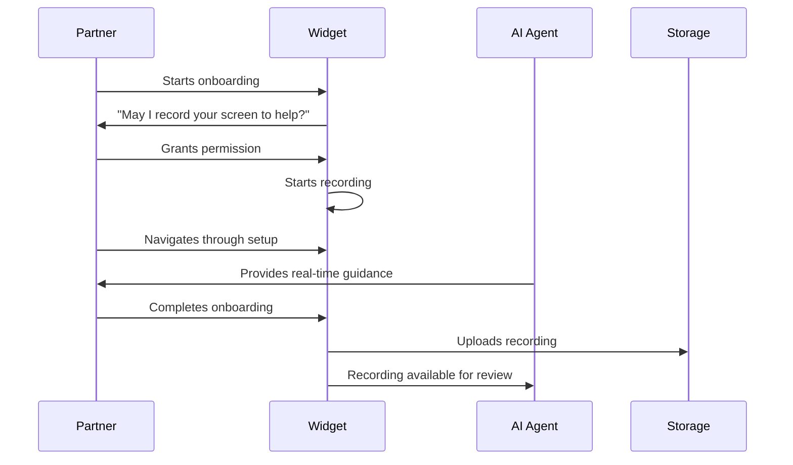
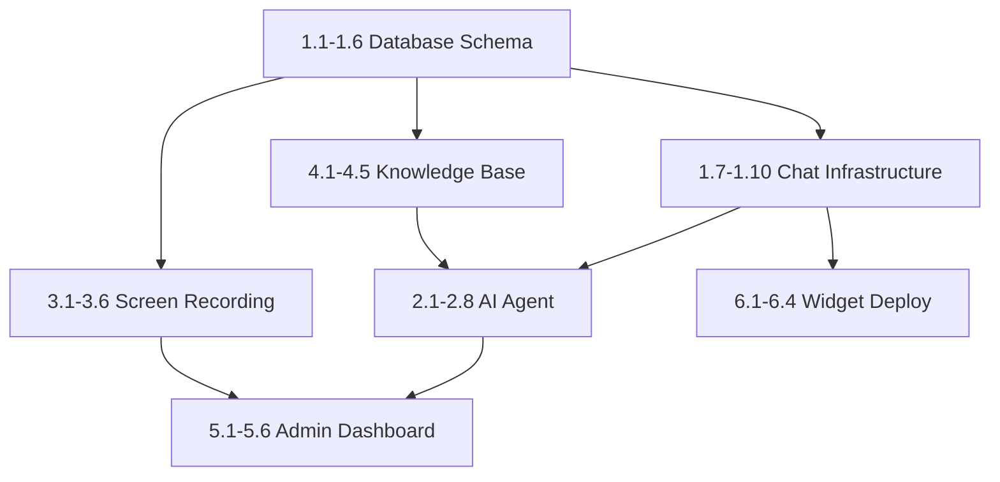

# Daily Event Insurance - Customer Support & Onboarding Agent PRD

**Version:** 1.0  
**Last Updated:** 2025-01-13  
**Status:** Draft

---

## 1. Executive Summary

### Vision
Create an AI-powered customer support system with live chat, screen recording for onboarding, and intelligent agent assistance. This system will handle partner onboarding, quote assistance, and general support inquiries while reducing human support overhead by 70%.

### Key Features
- **Live Chat Widget** - Embeddable chat for partners and customers
- **Screen Recording Agent** - Guided onboarding with screen capture
- **AI Support Agent** - Context-aware responses using RAG
- **Escalation System** - Seamless handoff to human agents
- **Knowledge Base Integration** - Self-service documentation

### Key Metrics
- **Response Time:** < 10 seconds for AI responses
- **Resolution Rate:** 80%+ without human intervention
- **Onboarding Completion:** 90%+ of partners complete onboarding
- **CSAT Score:** 4.5+ out of 5

---

## 2. Technical Architecture

### Stack
| Component | Technology |
|-----------|------------|
| **Chat Backend** | Next.js API Routes + WebSocket |
| **AI Agent** | OpenAI GPT-4o / Claude |
| **Screen Recording** | RecordRTC / rrweb |
| **Real-time Messaging** | Supabase Realtime or Pusher |
| **Knowledge Base** | Vector embeddings + Supabase pgvector |
| **Frontend** | React components with Framer Motion |
| **Storage** | Supabase Storage for recordings |

### System Diagram
```
┌─────────────────────────────────────────────────────────────┐
│                     Partner/Customer                         │
└─────────────────────┬───────────────────────────────────────┘
                      │
        ┌─────────────▼─────────────┐
        │     Chat Widget (React)   │
        │  - Live chat interface    │
        │  - Screen share button    │
        │  - File attachments       │
        └─────────────┬─────────────┘
                      │
        ┌─────────────▼─────────────┐
        │   WebSocket / Realtime    │
        │   (Supabase Realtime)     │
        └─────────────┬─────────────┘
                      │
        ┌─────────────▼─────────────┐
        │     AI Support Agent      │
        │  - Context awareness      │
        │  - RAG knowledge base     │
        │  - Tool calling           │
        └─────────────┬─────────────┘
                      │
        ┌─────────────▼─────────────┐
        │   Action Router           │
        │  - Quote lookup           │
        │  - Policy info            │
        │  - Onboarding help        │
        │  - Escalation             │
        └───────────────────────────┘
```

---

## 3. Database Schema Additions

```typescript
// Chat conversations
export const chatConversations = pgTable("chat_conversations", {
  id: uuid("id").primaryKey().defaultRandom(),
  
  // Participant info
  participantType: text("participant_type").notNull(), // partner, customer, lead, anonymous
  participantId: uuid("participant_id"), // references users/partners/leads
  participantEmail: text("participant_email"),
  participantName: text("participant_name"),
  
  // Session info
  sessionId: text("session_id").notNull(), // Browser session ID
  pageUrl: text("page_url"), // Where chat was initiated
  userAgent: text("user_agent"),
  
  // Context
  topic: text("topic"), // onboarding, quote_help, policy_question, general
  context: text("context"), // JSON with relevant IDs (quote_id, policy_id, etc.)
  
  // Status
  status: text("status").default("active"), // active, resolved, escalated, abandoned
  priority: text("priority").default("normal"), // low, normal, high, urgent
  
  // Assignment
  assignedAgentId: text("assigned_agent_id"), // AI agent or human agent ID
  escalatedAt: timestamp("escalated_at"),
  escalatedTo: uuid("escalated_to").references(() => users.id),
  escalationReason: text("escalation_reason"),
  
  // Satisfaction
  csatScore: integer("csat_score"), // 1-5
  csatFeedback: text("csat_feedback"),
  
  // Timestamps
  createdAt: timestamp("created_at").defaultNow().notNull(),
  updatedAt: timestamp("updated_at").defaultNow().notNull(),
  resolvedAt: timestamp("resolved_at"),
});

// Chat messages
export const chatMessages = pgTable("chat_messages", {
  id: uuid("id").primaryKey().defaultRandom(),
  conversationId: uuid("conversation_id").references(() => chatConversations.id, { onDelete: "cascade" }).notNull(),
  
  // Sender
  role: text("role").notNull(), // user, assistant, system, agent
  senderName: text("sender_name"),
  
  // Content
  content: text("content").notNull(),
  contentType: text("content_type").default("text"), // text, image, file, screen_recording, action
  
  // Attachments
  attachmentUrl: text("attachment_url"),
  attachmentType: text("attachment_type"), // image, pdf, video
  attachmentName: text("attachment_name"),
  
  // AI metadata
  aiModel: text("ai_model"), // gpt-4o, claude-3
  aiConfidence: decimal("ai_confidence", { precision: 3, scale: 2 }),
  toolsUsed: text("tools_used"), // JSON array of tools called
  
  // Status
  isRead: boolean("is_read").default(false),
  
  createdAt: timestamp("created_at").defaultNow().notNull(),
});

// Screen recordings for onboarding
export const screenRecordings = pgTable("screen_recordings", {
  id: uuid("id").primaryKey().defaultRandom(),
  
  // Owner
  partnerId: uuid("partner_id").references(() => partners.id),
  conversationId: uuid("conversation_id").references(() => chatConversations.id),
  
  // Recording info
  recordingUrl: text("recording_url").notNull(),
  thumbnailUrl: text("thumbnail_url"),
  duration: integer("duration"), // seconds
  fileSize: integer("file_size"), // bytes
  
  // Context
  purpose: text("purpose").notNull(), // onboarding, support, demo
  stepName: text("step_name"), // Which onboarding step
  pagesCaptured: text("pages_captured"), // JSON array of pages visited
  
  // Status
  status: text("status").default("processing"), // processing, ready, failed
  
  // Metadata
  browserInfo: text("browser_info"),
  screenResolution: text("screen_resolution"),
  
  createdAt: timestamp("created_at").defaultNow().notNull(),
});

// Knowledge base articles
export const knowledgeArticles = pgTable("knowledge_articles", {
  id: uuid("id").primaryKey().defaultRandom(),
  
  // Content
  title: text("title").notNull(),
  slug: text("slug").unique().notNull(),
  content: text("content").notNull(), // Markdown
  summary: text("summary"),
  
  // Categorization
  category: text("category").notNull(), // getting_started, quotes, policies, billing, integration
  tags: text("tags"), // JSON array
  
  // Search
  embedding: text("embedding"), // Vector embedding for semantic search
  
  // Status
  isPublished: boolean("is_published").default(true),
  sortOrder: integer("sort_order").default(0),
  
  // Metrics
  viewCount: integer("view_count").default(0),
  helpfulCount: integer("helpful_count").default(0),
  notHelpfulCount: integer("not_helpful_count").default(0),
  
  createdAt: timestamp("created_at").defaultNow().notNull(),
  updatedAt: timestamp("updated_at").defaultNow().notNull(),
});

// Canned responses for agents
export const cannedResponses = pgTable("canned_responses", {
  id: uuid("id").primaryKey().defaultRandom(),
  
  shortcut: text("shortcut").unique().notNull(), // /greeting, /pricing, etc.
  title: text("title").notNull(),
  content: text("content").notNull(),
  category: text("category"), // greeting, closing, pricing, technical
  
  // Usage tracking
  useCount: integer("use_count").default(0),
  
  isActive: boolean("is_active").default(true),
  createdAt: timestamp("created_at").defaultNow().notNull(),
});
```

---

## 4. Feature Breakdown

### Phase 1: Live Chat Infrastructure (Est: 12 hours)

| Task ID | Task | Est. Time | Dependencies |
|---------|------|-----------|--------------|
| 1.1 | Add chat_conversations table to schema | 30min | - |
| 1.2 | Add chat_messages table to schema | 30min | 1.1 |
| 1.3 | Add screen_recordings table to schema | 20min | - |
| 1.4 | Add knowledge_articles table to schema | 20min | - |
| 1.5 | Add canned_responses table to schema | 15min | - |
| 1.6 | Run Drizzle migrations | 15min | 1.1-1.5 |
| 1.7 | Set up Supabase Realtime for chat | 2hr | 1.6 |
| 1.8 | Create chat WebSocket API endpoint | 2hr | 1.7 |
| 1.9 | Build ChatWidget React component | 3hr | 1.8 |
| 1.10 | Create message persistence layer | 2hr | 1.2, 1.8 |

### Phase 2: AI Support Agent (Est: 10 hours)

| Task ID | Task | Est. Time | Dependencies |
|---------|------|-----------|--------------|
| 2.1 | Create AI agent service with OpenAI | 2hr | 1.8 |
| 2.2 | Build context loader (user, quotes, policies) | 1.5hr | 2.1 |
| 2.3 | Implement quote lookup tool | 1hr | 2.1 |
| 2.4 | Implement policy info tool | 1hr | 2.1 |
| 2.5 | Implement knowledge base search tool | 1.5hr | 1.4, 2.1 |
| 2.6 | Add escalation detection and routing | 1hr | 2.1 |
| 2.7 | Create response streaming for UX | 1hr | 2.1 |
| 2.8 | Build conversation history manager | 1hr | 1.10, 2.1 |

### Phase 3: Screen Recording & Onboarding (Est: 8 hours)

| Task ID | Task | Est. Time | Dependencies |
|---------|------|-----------|--------------|
| 3.1 | Integrate RecordRTC/rrweb library | 2hr | - |
| 3.2 | Create screen recording React hook | 1.5hr | 3.1 |
| 3.3 | Build recording upload to Supabase Storage | 1hr | 1.3, 3.2 |
| 3.4 | Create onboarding step tracker | 1hr | 3.2 |
| 3.5 | Build recording playback component | 1.5hr | 3.3 |
| 3.6 | Add recording annotations/notes | 1hr | 3.5 |

### Phase 4: Knowledge Base (Est: 6 hours)

| Task ID | Task | Est. Time | Dependencies |
|---------|------|-----------|--------------|
| 4.1 | Create knowledge article CRUD APIs | 1.5hr | 1.4 |
| 4.2 | Build article editor with markdown | 1.5hr | 4.1 |
| 4.3 | Implement vector embedding generation | 1hr | 4.1 |
| 4.4 | Create semantic search API | 1hr | 4.3 |
| 4.5 | Build public knowledge base UI | 1hr | 4.1 |

### Phase 5: Admin Dashboard (Est: 8 hours)

| Task ID | Task | Est. Time | Dependencies |
|---------|------|-----------|--------------|
| 5.1 | Create conversation list view | 1.5hr | 1.10 |
| 5.2 | Build conversation detail/reply interface | 2hr | 5.1 |
| 5.3 | Add agent takeover functionality | 1hr | 5.2 |
| 5.4 | Create analytics dashboard (response times, CSAT) | 2hr | 1.10 |
| 5.5 | Build canned response manager | 1hr | 1.5 |
| 5.6 | Add screen recording viewer | 0.5hr | 3.5 |

### Phase 6: Widget Deployment (Est: 4 hours)

| Task ID | Task | Est. Time | Dependencies |
|---------|------|-----------|--------------|
| 6.1 | Create embeddable widget bundle | 1.5hr | 1.9 |
| 6.2 | Build widget configuration options | 1hr | 6.1 |
| 6.3 | Add widget installation instructions | 0.5hr | 6.1 |
| 6.4 | Create partner-specific widget customization | 1hr | 6.2 |

---

## 5. AI Agent Capabilities

### System Prompt
```
You are Alex, a helpful customer support agent for Daily Event Insurance. 
You help partners and customers with:
- Understanding our insurance products (liability, equipment, cancellation)
- Getting quotes and purchasing policies
- Onboarding as a new partner
- Technical integration questions
- Billing and commission inquiries

You have access to:
- Partner and customer account information
- Quote and policy details
- Knowledge base articles
- Ability to schedule callbacks

Guidelines:
- Be friendly, professional, and concise
- If you don't know something, say so and offer to escalate
- For sensitive topics (refunds, disputes), escalate to human agent
- Always confirm you've understood the question before answering
```

### Available Tools
```typescript
const supportAgentTools = [
  {
    name: "lookup_quote",
    description: "Look up quote details by quote number or email",
    parameters: { quoteNumber: "string?", email: "string?" }
  },
  {
    name: "lookup_policy",
    description: "Look up policy details by policy number or email",
    parameters: { policyNumber: "string?", email: "string?" }
  },
  {
    name: "get_partner_info",
    description: "Get partner account details and status",
    parameters: { partnerId: "string" }
  },
  {
    name: "search_knowledge_base",
    description: "Search help articles for relevant information",
    parameters: { query: "string" }
  },
  {
    name: "schedule_callback",
    description: "Schedule a callback from a human agent",
    parameters: { phone: "string", preferredTime: "string", reason: "string" }
  },
  {
    name: "escalate_to_human",
    description: "Transfer conversation to a human agent",
    parameters: { reason: "string", priority: "string" }
  },
  {
    name: "create_support_ticket",
    description: "Create a support ticket for follow-up",
    parameters: { subject: "string", description: "string", priority: "string" }
  }
];
```

---

## 6. Chat Widget Configuration

### Embed Code
```html
<!-- Daily Event Insurance Chat Widget -->
<script>
  window.DEI_CHAT_CONFIG = {
    partnerId: "YOUR_PARTNER_ID", // Optional - for partner portals
    position: "bottom-right",
    primaryColor: "#14B8A6",
    greeting: "Hi! How can I help you today?",
    offlineMessage: "We're currently offline. Leave a message!",
    enableScreenRecording: true,
    enableFileUpload: true,
  };
</script>
<script src="https://dailyeventinsurance.com/widget/chat.js" async></script>
```

### Widget Features
- Persistent conversation across page navigation
- Typing indicators
- Read receipts
- File/image attachments (up to 10MB)
- Screen recording (partner portal only)
- Mobile responsive
- Offline message queue

---

## 7. Screen Recording Flow

### Onboarding Recording


### Recording Permissions
- Requires explicit user consent
- Audio optional (screen only by default)
- Can pause/resume
- Recordings auto-delete after 30 days
- Partners can request deletion

---

## 8. API Endpoints

### Chat
- `POST /api/chat/conversations` - Start conversation
- `GET /api/chat/conversations/[id]` - Get conversation
- `POST /api/chat/conversations/[id]/messages` - Send message
- `GET /api/chat/conversations/[id]/messages` - Get messages
- `POST /api/chat/conversations/[id]/escalate` - Escalate to human
- `POST /api/chat/conversations/[id]/resolve` - Mark resolved

### Screen Recording
- `POST /api/recordings/start` - Initialize recording session
- `POST /api/recordings/upload` - Upload recording chunk
- `POST /api/recordings/complete` - Finalize recording
- `GET /api/recordings/[id]` - Get recording details

### Knowledge Base
- `GET /api/knowledge` - List articles
- `GET /api/knowledge/[slug]` - Get article
- `POST /api/knowledge/search` - Semantic search
- `POST /api/admin/knowledge` - Create article (admin)
- `PATCH /api/admin/knowledge/[id]` - Update article (admin)

### Admin
- `GET /api/admin/conversations` - List all conversations
- `POST /api/admin/conversations/[id]/reply` - Agent reply
- `POST /api/admin/conversations/[id]/assign` - Assign to agent
- `GET /api/admin/support/analytics` - Support metrics

---

## 9. Success Metrics

| Metric | Target | Measurement |
|--------|--------|-------------|
| First Response Time | < 10s | Avg time to first AI response |
| AI Resolution Rate | > 80% | Resolved without human / Total |
| Escalation Rate | < 20% | Escalated to human / Total |
| CSAT Score | > 4.5/5 | Average customer satisfaction |
| Onboarding Completion | > 90% | Partners completing onboarding |
| Avg Handle Time | < 5 min | Avg conversation duration |

---

## 10. Implementation Order



---

## 11. Estimated Total Hours

| Phase | Hours |
|-------|-------|
| Phase 1: Chat Infrastructure | 12 |
| Phase 2: AI Support Agent | 10 |
| Phase 3: Screen Recording | 8 |
| Phase 4: Knowledge Base | 6 |
| Phase 5: Admin Dashboard | 8 |
| Phase 6: Widget Deployment | 4 |
| **Total** | **48 hours** |

---

## 12. Future Enhancements

- **Voice chat** - WebRTC audio support
- **Co-browsing** - Agent can see and interact with user's screen
- **Proactive chat** - Trigger chat based on user behavior
- **Multi-language support** - AI responses in user's language
- **Chatbot handoff** - Integrate with existing chatbots
- **Mobile SDK** - Native iOS/Android chat widget
