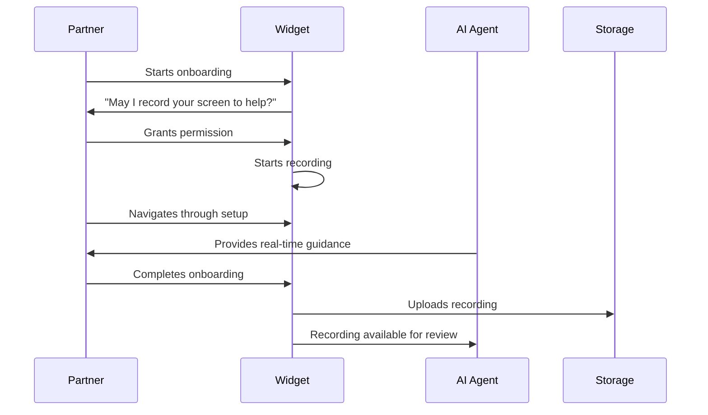
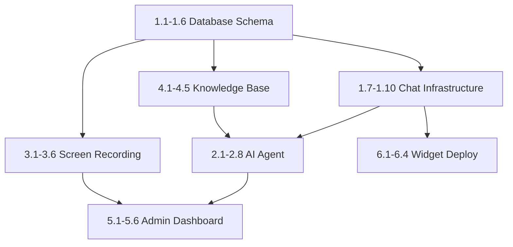

# Daily Event Insurance - Partner Integration Support Agent PRD

**Version:** 2.0  
**Last Updated:** 2025-01-13  
**Status:** Draft

---

## 1. Executive Summary

### Vision
Create an AI-powered technical support agent that helps partners with onboarding, POS system integrations, API endpoint management, widget installation, and troubleshooting. This is NOT a customer service tool for policy lookups - it's a **technical integration assistant** that helps partners successfully integrate Daily Event Insurance into their existing systems.

### Target Users
- **New Partners** going through onboarding
- **Technical Staff** at partner businesses implementing integrations
- **Existing Partners** troubleshooting issues or expanding integrations

### Key Features
- **Live Chat Widget** - Embedded in partner portal and onboarding flow
- **Screen Recording** - Capture partner's screen during onboarding for guided help
- **Integration Assistant** - Help with POS systems, booking platforms, API setup
- **Code Snippet Generator** - Generate custom widget/API code for partner's stack
- **Troubleshooting Agent** - Debug integration issues with context awareness
- **Escalation to Dev Team** - Seamless handoff for complex technical issues

### Key Metrics
- **Onboarding Completion:** 95%+ of partners complete setup
- **Integration Success Rate:** 90%+ first-time successful integrations
- **Time to Live:** < 24 hours from signup to live integration
- **Support Ticket Reduction:** 70% fewer escalations to human support

---

## 2. Technical Architecture

### Stack
| Component | Technology |
|-----------|------------|
| **Chat Backend** | Next.js API Routes + Supabase Realtime |
| **AI Agent** | OpenAI GPT-4o with function calling |
| **Screen Recording** | rrweb (DOM recording) + Supabase Storage |
| **Knowledge Base** | Vector embeddings for integration docs |
| **Frontend** | React components (existing onboarding flow) |
| **Code Generation** | AI-powered snippet generation |

### System Diagram
```
┌─────────────────────────────────────────────────────────────┐
│                     Partner (Technical User)                 │
└─────────────────────┬───────────────────────────────────────┘
                      │
        ┌─────────────▼─────────────┐
        │   Onboarding Flow / Chat  │
        │  - Live chat interface    │
        │  - Screen recording       │
        │  - Code snippet display   │
        └─────────────┬─────────────┘
                      │
        ┌─────────────▼─────────────┐
        │   AI Integration Agent    │
        │  - Onboarding context     │
        │  - POS system knowledge   │
        │  - API documentation      │
        │  - Troubleshooting logic  │
        └─────────────┬─────────────┘
                      │
        ┌─────────────▼─────────────┐
        │   Tool Functions          │
        │  - generate_widget_code   │
        │  - generate_api_snippet   │
        │  - check_integration      │
        │  - lookup_pos_docs        │
        │  - escalate_to_dev        │
        └───────────────────────────┘
```

---

## 3. Database Schema Additions

```typescript
// Support conversations - for partner integration help
export const supportConversations = pgTable("support_conversations", {
  id: uuid("id").primaryKey().defaultRandom(),
  
  // Partner info
  partnerId: uuid("partner_id").references(() => partners.id),
  partnerEmail: text("partner_email"),
  partnerName: text("partner_name"),
  
  // Session info
  sessionId: text("session_id").notNull(),
  pageUrl: text("page_url"), // Which onboarding step or partner portal page
  onboardingStep: integer("onboarding_step"), // 1-4 if in onboarding
  
  // Technical context
  topic: text("topic"), // onboarding, widget_install, api_integration, pos_setup, troubleshooting
  techStack: text("tech_stack"), // JSON: { framework: "react", pos: "mindbody", etc. }
  integrationContext: text("integration_context"), // JSON with current integration state
  
  // Status
  status: text("status").default("active"), // active, resolved, escalated, abandoned
  priority: text("priority").default("normal"), // low, normal, high, urgent
  
  // Escalation
  escalatedAt: timestamp("escalated_at"),
  escalatedTo: uuid("escalated_to").references(() => users.id),
  escalationReason: text("escalation_reason"),
  
  // Resolution
  resolution: text("resolution"), // How the issue was resolved
  resolvedAt: timestamp("resolved_at"),
  
  // Satisfaction
  helpfulRating: integer("helpful_rating"), // 1-5
  feedback: text("feedback"),
  
  createdAt: timestamp("created_at").defaultNow().notNull(),
  updatedAt: timestamp("updated_at").defaultNow().notNull(),
});

// Support messages
export const supportMessages = pgTable("support_messages", {
  id: uuid("id").primaryKey().defaultRandom(),
  conversationId: uuid("conversation_id").references(() => supportConversations.id, { onDelete: "cascade" }).notNull(),
  
  // Sender
  role: text("role").notNull(), // user, assistant, system
  
  // Content
  content: text("content").notNull(),
  contentType: text("content_type").default("text"), // text, code, error, action
  
  // Code snippets shared
  codeSnippet: text("code_snippet"), // Generated code
  codeLanguage: text("code_language"), // javascript, python, etc.
  
  // AI metadata
  toolsUsed: text("tools_used"), // JSON array of tools called
  
  createdAt: timestamp("created_at").defaultNow().notNull(),
});

// Screen recordings for onboarding assistance
export const onboardingRecordings = pgTable("onboarding_recordings", {
  id: uuid("id").primaryKey().defaultRandom(),
  
  // Owner
  partnerId: uuid("partner_id").references(() => partners.id),
  conversationId: uuid("conversation_id").references(() => supportConversations.id),
  
  // Recording info
  recordingUrl: text("recording_url").notNull(),
  duration: integer("duration"), // seconds
  
  // Context
  onboardingStep: integer("onboarding_step"), // 1-4
  stepName: text("step_name"), // Business Info, Integration, Customize, Go Live
  
  // Issues detected
  issuesDetected: text("issues_detected"), // JSON array of detected problems
  
  // Status
  status: text("status").default("processing"), // processing, ready, analyzed, failed
  
  createdAt: timestamp("created_at").defaultNow().notNull(),
});

// Integration documentation - for RAG
export const integrationDocs = pgTable("integration_docs", {
  id: uuid("id").primaryKey().defaultRandom(),
  
  // Content
  title: text("title").notNull(),
  slug: text("slug").unique().notNull(),
  content: text("content").notNull(), // Markdown
  
  // Categorization
  category: text("category").notNull(), // widget, api, pos, webhook, troubleshooting
  posSystem: text("pos_system"), // mindbody, pike13, etc. (if POS-specific)
  framework: text("framework"), // react, vue, vanilla (if framework-specific)
  
  // Search
  embedding: text("embedding"), // Vector embedding for semantic search
  
  // Code examples
  codeExamples: text("code_examples"), // JSON array of code snippets
  
  isPublished: boolean("is_published").default(true),
  createdAt: timestamp("created_at").defaultNow().notNull(),
  updatedAt: timestamp("updated_at").defaultNow().notNull(),
});

// Partner integration status tracking
export const partnerIntegrations = pgTable("partner_integrations", {
  id: uuid("id").primaryKey().defaultRandom(),
  partnerId: uuid("partner_id").references(() => partners.id).notNull(),
  
  // Integration type
  integrationType: text("integration_type").notNull(), // widget, api, pos
  posSystem: text("pos_system"), // mindbody, pike13, etc.
  
  // Status
  status: text("status").default("pending"), // pending, configured, testing, live, failed
  
  // Configuration
  configuration: text("configuration"), // JSON with integration settings
  apiKeyGenerated: boolean("api_key_generated").default(false),
  webhookConfigured: boolean("webhook_configured").default(false),
  
  // Testing
  lastTestedAt: timestamp("last_tested_at"),
  testResult: text("test_result"), // success, failed, partial
  testErrors: text("test_errors"), // JSON array of errors
  
  // Go live
  wentLiveAt: timestamp("went_live_at"),
  
  createdAt: timestamp("created_at").defaultNow().notNull(),
  updatedAt: timestamp("updated_at").defaultNow().notNull(),
});
```

---

## 4. Feature Breakdown

### Phase 1: Live Chat Infrastructure (Est: 12 hours)

| Task ID | Task | Est. Time | Dependencies |
|---------|------|-----------|--------------|
| 1.1 | Add chat_conversations table to schema | 30min | - |
| 1.2 | Add chat_messages table to schema | 30min | 1.1 |
| 1.3 | Add screen_recordings table to schema | 20min | - |
| 1.4 | Add knowledge_articles table to schema | 20min | - |
| 1.5 | Add canned_responses table to schema | 15min | - |
| 1.6 | Run Drizzle migrations | 15min | 1.1-1.5 |
| 1.7 | Set up Supabase Realtime for chat | 2hr | 1.6 |
| 1.8 | Create chat WebSocket API endpoint | 2hr | 1.7 |
| 1.9 | Build ChatWidget React component | 3hr | 1.8 |
| 1.10 | Create message persistence layer | 2hr | 1.2, 1.8 |

### Phase 2: AI Support Agent (Est: 10 hours)

| Task ID | Task | Est. Time | Dependencies |
|---------|------|-----------|--------------|
| 2.1 | Create AI agent service with OpenAI | 2hr | 1.8 |
| 2.2 | Build context loader (user, quotes, policies) | 1.5hr | 2.1 |
| 2.3 | Implement quote lookup tool | 1hr | 2.1 |
| 2.4 | Implement policy info tool | 1hr | 2.1 |
| 2.5 | Implement knowledge base search tool | 1.5hr | 1.4, 2.1 |
| 2.6 | Add escalation detection and routing | 1hr | 2.1 |
| 2.7 | Create response streaming for UX | 1hr | 2.1 |
| 2.8 | Build conversation history manager | 1hr | 1.10, 2.1 |

### Phase 3: Screen Recording & Onboarding (Est: 8 hours)

| Task ID | Task | Est. Time | Dependencies |
|---------|------|-----------|--------------|
| 3.1 | Integrate RecordRTC/rrweb library | 2hr | - |
| 3.2 | Create screen recording React hook | 1.5hr | 3.1 |
| 3.3 | Build recording upload to Supabase Storage | 1hr | 1.3, 3.2 |
| 3.4 | Create onboarding step tracker | 1hr | 3.2 |
| 3.5 | Build recording playback component | 1.5hr | 3.3 |
| 3.6 | Add recording annotations/notes | 1hr | 3.5 |

### Phase 4: Knowledge Base (Est: 6 hours)

| Task ID | Task | Est. Time | Dependencies |
|---------|------|-----------|--------------|
| 4.1 | Create knowledge article CRUD APIs | 1.5hr | 1.4 |
| 4.2 | Build article editor with markdown | 1.5hr | 4.1 |
| 4.3 | Implement vector embedding generation | 1hr | 4.1 |
| 4.4 | Create semantic search API | 1hr | 4.3 |
| 4.5 | Build public knowledge base UI | 1hr | 4.1 |

### Phase 5: Admin Dashboard (Est: 8 hours)

| Task ID | Task | Est. Time | Dependencies |
|---------|------|-----------|--------------|
| 5.1 | Create conversation list view | 1.5hr | 1.10 |
| 5.2 | Build conversation detail/reply interface | 2hr | 5.1 |
| 5.3 | Add agent takeover functionality | 1hr | 5.2 |
| 5.4 | Create analytics dashboard (response times, CSAT) | 2hr | 1.10 |
| 5.5 | Build canned response manager | 1hr | 1.5 |
| 5.6 | Add screen recording viewer | 0.5hr | 3.5 |

### Phase 6: Widget Deployment (Est: 4 hours)

| Task ID | Task | Est. Time | Dependencies |
|---------|------|-----------|--------------|
| 6.1 | Create embeddable widget bundle | 1.5hr | 1.9 |
| 6.2 | Build widget configuration options | 1hr | 6.1 |
| 6.3 | Add widget installation instructions | 0.5hr | 6.1 |
| 6.4 | Create partner-specific widget customization | 1hr | 6.2 |

---

## 5. AI Agent Capabilities

### System Prompt
```
You are a technical integration specialist for Daily Event Insurance. You help partners 
integrate our insurance products into their existing systems - POS, booking platforms, 
websites, and custom applications.

Your expertise:
- Widget installation (JavaScript embed, React component)
- REST API integration (quotes, policies, webhooks)
- POS system integrations (Mindbody, Pike13, ClubReady, Mariana Tek, Square)
- Booking platform connections (Calendly, Acuity, custom systems)
- Troubleshooting integration issues
- Guiding partners through the onboarding flow

You have access to:
- Partner's current onboarding step and business info
- Code snippet generator for their specific tech stack
- Integration documentation and examples
- POS-specific setup guides
- Ability to test their integration endpoints

Guidelines:
- Be technical but accessible - explain concepts clearly
- Provide code examples when helpful
- If you detect an error, explain what went wrong and how to fix it
- For complex custom integrations, escalate to the dev team
- Always confirm their tech stack before providing code
```

### Available Tools
```typescript
const integrationAgentTools = [
  {
    name: "generate_widget_code",
    description: "Generate widget embed code for partner's website",
    parameters: {
      partnerId: "string",
      framework: "vanilla | react | vue | angular",
      customization: {
        primaryColor: "string?",
        position: "bottom-right | bottom-left | inline",
        products: "string[]"
      }
    }
  },
  {
    name: "generate_api_snippet",
    description: "Generate API integration code snippet",
    parameters: {
      language: "javascript | python | php | curl",
      endpoint: "create_quote | get_policy | webhook_setup",
      partnerId: "string"
    }
  },
  {
    name: "get_pos_integration_guide",
    description: "Get step-by-step integration guide for a specific POS system",
    parameters: {
      posSystem: "mindbody | pike13 | clubready | mariana_tek | square | custom",
      integrationType: "widget | api | webhook"
    }
  },
  {
    name: "check_integration_status",
    description: "Check if partner's integration is working correctly",
    parameters: {
      partnerId: "string",
      checkType: "widget_installed | api_connected | webhook_active"
    }
  },
  {
    name: "get_partner_onboarding_status",
    description: "Get partner's current onboarding step and configuration",
    parameters: { partnerId: "string" }
  },
  {
    name: "test_api_endpoint",
    description: "Test partner's API endpoint connectivity",
    parameters: {
      partnerId: "string",
      endpoint: "string",
      method: "GET | POST"
    }
  },
  {
    name: "search_integration_docs",
    description: "Search integration documentation for specific topics",
    parameters: { query: "string", category: "widget | api | pos | troubleshooting" }
  },
  {
    name: "escalate_to_dev_team",
    description: "Escalate complex technical issue to development team",
    parameters: {
      issue: "string",
      partnerInfo: "string",
      errorLogs: "string?",
      priority: "low | medium | high | urgent"
    }
  }
];
```

### POS System Knowledge Base
```typescript
const posIntegrations = {
  mindbody: {
    name: "Mindbody",
    integrationTypes: ["webhook", "api"],
    setupGuide: "/docs/integrations/mindbody",
    commonIssues: ["OAuth token expiry", "Webhook URL validation", "Class booking sync"]
  },
  pike13: {
    name: "Pike13",
    integrationTypes: ["webhook", "widget"],
    setupGuide: "/docs/integrations/pike13",
    commonIssues: ["API rate limits", "Member ID mapping"]
  },
  clubready: {
    name: "ClubReady",
    integrationTypes: ["api", "widget"],
    setupGuide: "/docs/integrations/clubready",
    commonIssues: ["Authentication flow", "Event type mapping"]
  },
  mariana_tek: {
    name: "Mariana Tek",
    integrationTypes: ["webhook", "api"],
    setupGuide: "/docs/integrations/mariana-tek",
    commonIssues: ["GraphQL queries", "Subscription handling"]
  },
  square: {
    name: "Square",
    integrationTypes: ["api", "webhook"],
    setupGuide: "/docs/integrations/square",
    commonIssues: ["Location ID setup", "Item catalog sync"]
  }
};
```

---

## 6. Chat Widget Configuration

### Embed Code
```html
<!-- Daily Event Insurance Chat Widget -->
<script>
  window.DEI_CHAT_CONFIG = {
    partnerId: "YOUR_PARTNER_ID", // Optional - for partner portals
    position: "bottom-right",
    primaryColor: "#14B8A6",
    greeting: "Hi! How can I help you today?",
    offlineMessage: "We're currently offline. Leave a message!",
    enableScreenRecording: true,
    enableFileUpload: true,
  };
</script>
<script src="https://dailyeventinsurance.com/widget/chat.js" async></script>
```

### Widget Features
- Persistent conversation across page navigation
- Typing indicators
- Read receipts
- File/image attachments (up to 10MB)
- Screen recording (partner portal only)
- Mobile responsive
- Offline message queue

---

## 7. Screen Recording Flow

### Onboarding Recording


### Recording Permissions
- Requires explicit user consent
- Audio optional (screen only by default)
- Can pause/resume
- Recordings auto-delete after 30 days
- Partners can request deletion

---

## 8. API Endpoints

### Chat
- `POST /api/chat/conversations` - Start conversation
- `GET /api/chat/conversations/[id]` - Get conversation
- `POST /api/chat/conversations/[id]/messages` - Send message
- `GET /api/chat/conversations/[id]/messages` - Get messages
- `POST /api/chat/conversations/[id]/escalate` - Escalate to human
- `POST /api/chat/conversations/[id]/resolve` - Mark resolved

### Screen Recording
- `POST /api/recordings/start` - Initialize recording session
- `POST /api/recordings/upload` - Upload recording chunk
- `POST /api/recordings/complete` - Finalize recording
- `GET /api/recordings/[id]` - Get recording details

### Knowledge Base
- `GET /api/knowledge` - List articles
- `GET /api/knowledge/[slug]` - Get article
- `POST /api/knowledge/search` - Semantic search
- `POST /api/admin/knowledge` - Create article (admin)
- `PATCH /api/admin/knowledge/[id]` - Update article (admin)

### Admin
- `GET /api/admin/conversations` - List all conversations
- `POST /api/admin/conversations/[id]/reply` - Agent reply
- `POST /api/admin/conversations/[id]/assign` - Assign to agent
- `GET /api/admin/support/analytics` - Support metrics

---

## 9. Success Metrics

| Metric | Target | Measurement |
|--------|--------|-------------|
| First Response Time | < 10s | Avg time to first AI response |
| AI Resolution Rate | > 80% | Resolved without human / Total |
| Escalation Rate | < 20% | Escalated to human / Total |
| CSAT Score | > 4.5/5 | Average customer satisfaction |
| Onboarding Completion | > 90% | Partners completing onboarding |
| Avg Handle Time | < 5 min | Avg conversation duration |

---

## 10. Implementation Order



---

## 11. Estimated Total Hours

| Phase | Hours |
|-------|-------|
| Phase 1: Chat Infrastructure | 12 |
| Phase 2: AI Support Agent | 10 |
| Phase 3: Screen Recording | 8 |
| Phase 4: Knowledge Base | 6 |
| Phase 5: Admin Dashboard | 8 |
| Phase 6: Widget Deployment | 4 |
| **Total** | **48 hours** |

---

## 12. Future Enhancements

- **Voice chat** - WebRTC audio support
- **Co-browsing** - Agent can see and interact with user's screen
- **Proactive chat** - Trigger chat based on user behavior
- **Multi-language support** - AI responses in user's language
- **Chatbot handoff** - Integrate with existing chatbots
- **Mobile SDK** - Native iOS/Android chat widget
