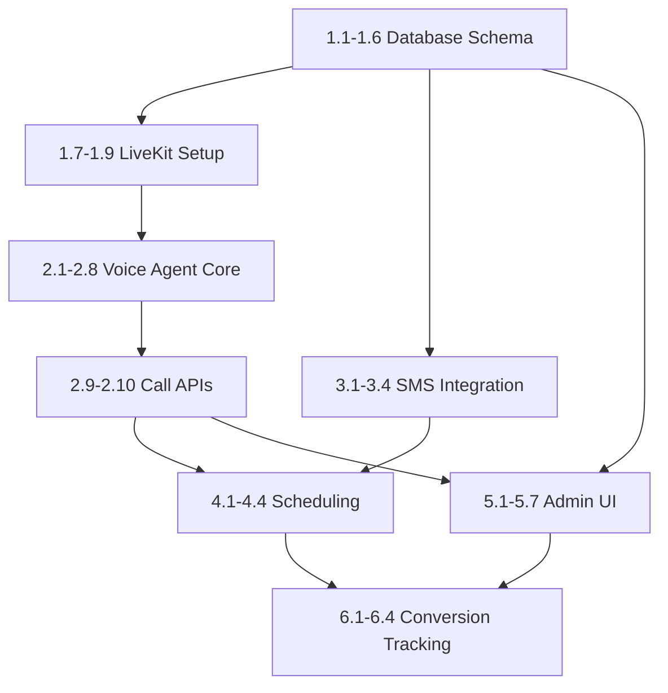

# Daily Event Insurance - LiveKit AI Call Center PRD

**Version:** 3.0  
**Last Updated:** 2025-01-12  
**Status:** Draft

---

## 1. Executive Summary

### Vision
Transform $40 leads into $100+ converted customers using an AI-powered voice agent built on self-hosted LiveKit. The system provides automated outbound calling, SMS communication, personalized scripts, and real-time conversion tracking within the existing Daily Event Insurance admin portal.

### Key Metrics
- **Lead Value Increase:** $40 → $100 (150% increase)
- **Conversion Rate Target:** 40%+ of contacted leads
- **Response Time:** < 5 minutes for new leads
- **Cost Reduction:** 80% vs human call center

---

## 2. Technical Architecture

### Stack
| Component | Technology |
|-----------|------------|
| **Voice AI** | LiveKit Agents (Python) - Self-hosted |
| **Telephony** | LiveKit SIP + Twilio/Telnyx trunk |
| **SMS** | Twilio API |
| **Frontend** | Next.js 16 + React 19 (existing) |
| **Database** | Neon PostgreSQL + Drizzle ORM |
| **Backend** | Next.js API Routes |
| **Cron Jobs** | Vercel Cron or node-cron |
| **Realtime Updates** | Supabase Realtime or polling |

### Self-Hosted LiveKit Setup
```yaml
# docker-compose.livekit.yml
services:
  livekit:
    image: livekit/livekit-server:latest
    ports:
      - "7880:7880"  # HTTP
      - "7881:7881"  # WebRTC TCP
      - "50000-60000:50000-60000/udp"  # WebRTC UDP
    environment:
      - LIVEKIT_KEYS=your_api_key:your_api_secret
    volumes:
      - ./livekit.yaml:/etc/livekit.yaml
    command: ["--config", "/etc/livekit.yaml"]

  livekit-agent:
    build: ./agents
    environment:
      - LIVEKIT_URL=ws://livekit:7880
      - LIVEKIT_API_KEY=your_api_key
      - LIVEKIT_API_SECRET=your_api_secret
      - OPENAI_API_KEY=${OPENAI_API_KEY}
    depends_on:
      - livekit
```

---

## 3. Database Schema Additions

### New Tables

```typescript
// leads - Central lead management
export const leads = pgTable("leads", {
  id: uuid("id").primaryKey().defaultRandom(),
  
  // Source tracking
  source: text("source").notNull(), // website_quote, partner_referral, cold_list, ad_campaign
  sourceDetails: text("source_details"), // JSON: campaign_id, partner_id, etc.
  
  // Contact info
  firstName: text("first_name").notNull(),
  lastName: text("last_name").notNull(),
  email: text("email").notNull(),
  phone: text("phone").notNull(),
  
  // Business context
  businessType: text("business_type"), // gym, climbing, rental, adventure
  businessName: text("business_name"),
  estimatedParticipants: integer("estimated_participants"),
  
  // Interest & Activity scoring
  interestLevel: text("interest_level").default("cold"), // cold, warm, hot
  interestScore: integer("interest_score").default(0), // 0-100
  lastActivityAt: timestamp("last_activity_at"),
  activityHistory: text("activity_history"), // JSON array of actions
  
  // Geographic
  city: text("city"),
  state: text("state"),
  zipCode: text("zip_code"),
  timezone: text("timezone").default("America/Los_Angeles"),
  
  // Lead value
  initialValue: decimal("initial_value", { precision: 10, scale: 2 }).default("40.00"),
  convertedValue: decimal("converted_value", { precision: 10, scale: 2 }),
  
  // Status workflow
  status: text("status").default("new"), // new, contacted, qualified, demo_scheduled, proposal_sent, converted, lost, dnc
  statusReason: text("status_reason"),
  
  // Assignment
  assignedAgentId: text("assigned_agent_id"), // AI agent or human
  
  // Conversion tracking
  convertedAt: timestamp("converted_at"),
  convertedPolicyId: uuid("converted_policy_id").references(() => policies.id),
  
  // Timestamps
  createdAt: timestamp("created_at").defaultNow().notNull(),
  updatedAt: timestamp("updated_at").defaultNow().notNull(),
});

// lead_communications - All interactions
export const leadCommunications = pgTable("lead_communications", {
  id: uuid("id").primaryKey().defaultRandom(),
  leadId: uuid("lead_id").references(() => leads.id, { onDelete: "cascade" }).notNull(),
  
  // Communication type
  channel: text("channel").notNull(), // call, sms, email
  direction: text("direction").notNull(), // inbound, outbound
  
  // Call-specific
  callDuration: integer("call_duration"), // seconds
  callRecordingUrl: text("call_recording_url"),
  callTranscript: text("call_transcript"), // Full transcript JSON
  callSummary: text("call_summary"), // AI-generated summary
  
  // SMS-specific
  smsContent: text("sms_content"),
  smsStatus: text("sms_status"), // sent, delivered, failed, received
  
  // Disposition
  disposition: text("disposition"), // reached, voicemail, no_answer, busy, callback_requested, not_interested, dnc
  nextFollowUpAt: timestamp("next_follow_up_at"),
  
  // AI Agent tracking
  agentId: text("agent_id"), // Which AI agent handled
  agentScriptUsed: text("agent_script_used"), // Script identifier
  agentConfidenceScore: decimal("agent_confidence_score", { precision: 3, scale: 2 }), // 0.00-1.00
  
  // Sentiment & outcome
  sentimentScore: decimal("sentiment_score", { precision: 3, scale: 2 }), // -1.00 to 1.00
  outcome: text("outcome"), // positive, neutral, negative, escalate
  
  // LiveKit tracking
  livekitRoomId: text("livekit_room_id"),
  livekitSessionId: text("livekit_session_id"),
  
  createdAt: timestamp("created_at").defaultNow().notNull(),
});

// agent_scripts - Customizable AI scripts
export const agentScripts = pgTable("agent_scripts", {
  id: uuid("id").primaryKey().defaultRandom(),
  
  name: text("name").notNull(),
  description: text("description"),
  
  // Targeting
  businessType: text("business_type"), // null = all types
  interestLevel: text("interest_level"), // cold, warm, hot
  geographicRegion: text("geographic_region"), // null = all regions
  
  // Script content
  systemPrompt: text("system_prompt").notNull(), // Base AI instructions
  openingScript: text("opening_script").notNull(), // How to start the call
  keyPoints: text("key_points"), // JSON array of talking points
  objectionHandlers: text("objection_handlers"), // JSON map of objection -> response
  closingScript: text("closing_script"),
  
  // Configuration
  maxCallDuration: integer("max_call_duration").default(300), // seconds
  voiceId: text("voice_id").default("alloy"), // TTS voice
  
  isActive: boolean("is_active").default(true),
  priority: integer("priority").default(0), // Higher = preferred
  
  createdAt: timestamp("created_at").defaultNow().notNull(),
  updatedAt: timestamp("updated_at").defaultNow().notNull(),
});

// scheduled_actions - Cron-driven follow-ups
export const scheduledActions = pgTable("scheduled_actions", {
  id: uuid("id").primaryKey().defaultRandom(),
  leadId: uuid("lead_id").references(() => leads.id, { onDelete: "cascade" }).notNull(),
  
  actionType: text("action_type").notNull(), // call, sms, email
  scheduledFor: timestamp("scheduled_for").notNull(),
  
  // Context
  reason: text("reason"), // follow_up, reminder, callback_requested
  scriptId: uuid("script_id").references(() => agentScripts.id),
  customMessage: text("custom_message"),
  
  // Status
  status: text("status").default("pending"), // pending, processing, completed, failed, cancelled
  attempts: integer("attempts").default(0),
  maxAttempts: integer("max_attempts").default(3),
  
  processedAt: timestamp("processed_at"),
  error: text("error"),
  
  createdAt: timestamp("created_at").defaultNow().notNull(),
});

// conversion_events - Track the $40→$100 journey
export const conversionEvents = pgTable("conversion_events", {
  id: uuid("id").primaryKey().defaultRandom(),
  leadId: uuid("lead_id").references(() => leads.id).notNull(),
  
  eventType: text("event_type").notNull(), // page_view, quote_started, call_completed, demo_scheduled, proposal_viewed, converted
  eventValue: decimal("event_value", { precision: 10, scale: 2 }), // Attributed value
  
  metadata: text("metadata"), // JSON with event details
  
  createdAt: timestamp("created_at").defaultNow().notNull(),
});
```

---

## 4. Feature Breakdown

### Phase 1: Infrastructure & Schema (Est: 8 hours)

| Task ID | Task | Est. Time | Dependencies |
|---------|------|-----------|--------------|
| 1.1 | Add leads table to Drizzle schema | 30min | - |
| 1.2 | Add lead_communications table | 30min | 1.1 |
| 1.3 | Add agent_scripts table | 20min | - |
| 1.4 | Add scheduled_actions table | 20min | 1.1 |
| 1.5 | Add conversion_events table | 15min | 1.1 |
| 1.6 | Run Drizzle migrations | 15min | 1.1-1.5 |
| 1.7 | Set up LiveKit Docker infrastructure | 2hr | - |
| 1.8 | Configure Twilio SIP trunk | 1hr | 1.7 |
| 1.9 | Create base LiveKit agent scaffold | 2hr | 1.7 |

### Phase 2: AI Voice Agent (Est: 12 hours)

| Task ID | Task | Est. Time | Dependencies |
|---------|------|-----------|--------------|
| 2.1 | Create LiveKit agent entry point | 1hr | 1.9 |
| 2.2 | Implement script selection logic | 1hr | 1.3, 2.1 |
| 2.3 | Build lead context loader tool | 1hr | 1.1, 2.1 |
| 2.4 | Implement call disposition handler | 1hr | 1.2, 2.1 |
| 2.5 | Add voicemail detection | 1hr | 2.1 |
| 2.6 | Build callback scheduling tool | 1hr | 1.4, 2.1 |
| 2.7 | Implement sentiment analysis | 1hr | 2.1 |
| 2.8 | Add call transcript logging | 1hr | 1.2, 2.1 |
| 2.9 | Create outbound call API endpoint | 2hr | 2.1-2.8 |
| 2.10 | Create inbound call handler | 2hr | 2.1-2.8 |

### Phase 3: SMS Integration (Est: 4 hours)

| Task ID | Task | Est. Time | Dependencies |
|---------|------|-----------|--------------|
| 3.1 | Create Twilio SMS service | 1hr | - |
| 3.2 | Build outbound SMS API endpoint | 1hr | 3.1 |
| 3.3 | Create inbound SMS webhook | 1hr | 3.1 |
| 3.4 | Add SMS to communication log | 1hr | 1.2, 3.1-3.3 |

### Phase 4: Cron & Scheduling (Est: 4 hours)

| Task ID | Task | Est. Time | Dependencies |
|---------|------|-----------|--------------|
| 4.1 | Create scheduled actions processor | 1.5hr | 1.4 |
| 4.2 | Build reminder creation API | 1hr | 1.4 |
| 4.3 | Set up Vercel cron job | 30min | 4.1 |
| 4.4 | Add follow-up based on call outcome | 1hr | 2.4, 4.1 |

### Phase 5: Admin Dashboard UI (Est: 10 hours)

| Task ID | Task | Est. Time | Dependencies |
|---------|------|-----------|--------------|
| 5.1 | Create leads list page | 2hr | 1.1 |
| 5.2 | Build lead detail page | 2hr | 5.1 |
| 5.3 | Add communication history component | 1hr | 1.2, 5.2 |
| 5.4 | Create call player component | 1hr | 5.3 |
| 5.5 | Build script management page | 1.5hr | 1.3 |
| 5.6 | Create conversion analytics dashboard | 2hr | 1.5 |
| 5.7 | Add real-time updates | 30min | 5.1-5.6 |

### Phase 6: Conversion Tracking (Est: 4 hours)

| Task ID | Task | Est. Time | Dependencies |
|---------|------|-----------|--------------|
| 6.1 | Create conversion event logger | 1hr | 1.5 |
| 6.2 | Build lead value calculator | 1hr | 6.1 |
| 6.3 | Add conversion attribution | 1hr | 6.1-6.2 |
| 6.4 | Create conversion reports API | 1hr | 6.1-6.3 |

---

## 5. AI Agent Script Examples

### Cold Lead (Gym) - Opening Script
```
Hello, is this {first_name}? This is Alex calling from Daily Event Insurance. 
I noticed you recently looked at liability coverage for {business_name}. 
I wanted to personally reach out because gyms like yours can actually 
generate additional revenue by offering same-day insurance to members. 
Do you have two minutes to hear how this works?
```

### Hot Lead - Closing Script
```
Based on what you've told me about {business_name} seeing {estimated_participants} 
members monthly, you're looking at about ${projected_revenue} in additional revenue 
with zero overhead. I can have you set up and earning by end of week. 
Should I send over the partner agreement now, or would you prefer a quick 
demo of the member checkout experience first?
```

### Geographic Customization (California)
```json
{
  "region": "california",
  "compliance_note": "Must mention CA insurance regulations",
  "local_reference": "Like ClimbX in San Diego and Summit Fitness in LA",
  "timezone_greeting": "afternoon" // if calling PST afternoon
}
```

---

## 6. API Endpoints

### Lead Management
- `POST /api/admin/leads` - Create lead
- `GET /api/admin/leads` - List leads with filters
- `GET /api/admin/leads/[id]` - Get lead details
- `PATCH /api/admin/leads/[id]` - Update lead
- `POST /api/admin/leads/[id]/call` - Initiate outbound call
- `POST /api/admin/leads/[id]/sms` - Send SMS

### Communication
- `GET /api/admin/leads/[id]/communications` - Get history
- `POST /api/webhooks/livekit` - LiveKit call events
- `POST /api/webhooks/twilio/sms` - Twilio SMS webhooks

### Scripts
- `GET /api/admin/scripts` - List scripts
- `POST /api/admin/scripts` - Create script
- `PATCH /api/admin/scripts/[id]` - Update script

### Analytics
- `GET /api/admin/analytics/conversions` - Conversion data
- `GET /api/admin/analytics/agent-performance` - AI agent stats

---

## 7. Success Metrics

| Metric | Target | Measurement |
|--------|--------|-------------|
| Contact Rate | > 70% | Leads reached / Total leads |
| Conversion Rate | > 40% | Conversions / Leads contacted |
| Avg Lead Value | $100+ | Sum(converted_value) / Count(conversions) |
| First Response Time | < 5 min | Time from lead creation to first contact |
| Call Duration | 2-5 min | Average for successful calls |
| Cost per Conversion | < $5 | Infrastructure cost / Conversions |

---

## 8. Implementation Order



---

## 9. Estimated Total Hours

| Phase | Hours |
|-------|-------|
| Phase 1: Infrastructure | 8 |
| Phase 2: Voice Agent | 12 |
| Phase 3: SMS | 4 |
| Phase 4: Scheduling | 4 |
| Phase 5: Admin UI | 10 |
| Phase 6: Conversion | 4 |
| **Total** | **42 hours** |
